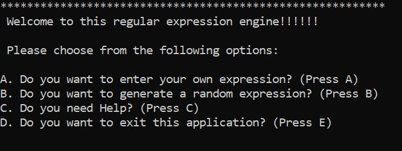

<h1>Introduction</h1>
<h3>
This repository contains a regular expression engine. Which is built using an algorithm called Thompsons construction. Thompsons construction is a method of transforming a regular expression into an equivalent NFA (Nondeterministic finite automata). A regular expression is entered in or generated followed by a string to compare to the regular expression. The application then outputs a True or False statement indicating whether the entered expression and comparable string is in fact a regular expression when executed together.
I will now discuss the various files and features that are included in this application and explain how each of them work. 
home.py
The file home.py acts like a main menu or, in the context of a game or other application this would be the first screen you see upon opening the application. It acts as a guide to the user of the application on what they can do and how they can achieve the results they are looking for. The layout was developed with simplicity and ease of use in mind to allow any user to navigate the various features this application has to offer with ease and without having to feel like they have to spend a lot of time learning how to use it. 
Upon running home.py the user is faced with the following options
</h3>

Each of these options is clearly laid out in an easy to understand manner with each selection bringing the user to a different part of the application or allowing them to exit the application. If for example the user presses A it will bring them to a new set of instructions informing them how they can enter in their own regular expressions.

Each clearly laid out instruction informs them of how they can achieve everything from simply entering in their own regular expression, entering their own expression and printing it to a file to entering their name to get a more personalized experience from using this program.
If the user presses B when in this menu, they get a similar set of instructions but instead of options about entering in their own expressions it gives them options to execute a file where the system will generate random expressions and comparable strings for them. This was built with learning in mind so the user can get a better grasp of how regular expressions work, what expressions work with what strings and what does not work. When the user can visualize what is happening, I think it will help them understand more of how the whole process works.

Pressing C in this main menu will instruct the user about how to get help running this application should they need it. Below is an image of what instructions are produced if C is press on this options menu.

Finally pressing E will exit this menu and stop the program. This is because the menu is built with a while loop. This was done to stop users entering in invalid options such as pressing x. This gives more control to the program and stops it from crashing if an invalid option is entered. 
The menu itself is designed simply each option for example (A) has a method that is fired upon pressing this button in either higher or lower case this is achieved using the casefold() method. Depending on what option is press depends on what method is fired. Any invalid selections will cause the loop to continue, where any correct options pressed will follow with a break from the loop and firing of the associated method. 
The methods themselves just contain well laid out text informing the user of how to use the selected function and what commands to run to achieve their desired output or result. 

<h1>ownExpr.py</h1>
This file contains features that enable the user to enter in their own regular expression and string to inform them if their entered data is a regular expression or not. It is built around command line arguments with each command enabling them to use different features.
The command line tools are made available through a package called “argparse”. This package makes it easy to write command line interfaces. The command line arguments used for this class are own this allows you to enter in your own expressions and strings. There is also one called output with a shortcut of “-o” that enables you to print your expressions to a file called expression.txt and finally there is a command line tool to enable you to enter your name for a more personalized experience with his application. This is called name and has a shortcut of –n. 
When these expressions are entered together into the command line after typing ownExpr.py own --o --n Keith for example it enables you to use these features in this program and allows you to use them, each can be used on their own as well. (With the exception of the own command which must be present)
The program uses the input() method to take in the users input for both the regular expression and the comparable string and stores them both in a variable. These variables are then passed into the match function in the regex file by using regex.match(var1, var2) which then compares them and outputs a true or false statement. 
When you have entered in your expression and string and got your result, you will be asked if you want to enter in another and depending on if you do or not the program will exit or keep going. When you do finish entering in your expressions the output is then parsed using the parser.parse_args() function If you opted to print your results to file a message is displayed telling you how you can access your file. 

<h1>randExpr.py</h1>
This file works much the same as ownExpr.py in terms of command line arguments and for the most part how it’s set up, but instead of entering in your own expressions and strings it randomly generates them from a list of pre-defined expressions and strings. To access this set of command line features you must enter randExpr.py rand -o --name Keith for example, with rand being the mandatory expression to use this file. These expressions and strings are stored in lists containing several different variations of regular expressions and strings to compare them against.
Two variables are then set up and assigned to random.choice() which is a method from the random library. This will randomly choose a predefined string from each of these lists. Both variables are then passed into regex.match(var1, var2). 
The subsequent actions are then the exact same as ownExpr.py You will be asked if you want to generate another expression or not, when you exit depending on if you opted to print your options to file you will be given details on how to access the file. 
You can also access help command line arguments by typing in the name of either file with the –h argument. Example randExpr.py –h. This will bring up help tools on each argument. 

<h1>help.py</h1>
This feature displays to the user information to help them run and understand the program on a higher level. While this is set up as a command line argument, there is no mandatory expression to use here. The user just has run help.py. This was a design decision which was made to make running this file as simple as possible. As it does not take any knowledge of command line arguments. 

<h1>regex.py</h1>
This file is the backbone of this application. This file takes in and compiles the regular expression and checks it to the string that has been entered to compare it against. It then outputs a true or false statement telling the user if it is or is not a regular expression. For a more detailed description of the classes, methods and features used in this file please see readme.md

<h1>test.py</h1>
This contains a test class which implements the unit test package to carry out these tests. It was set up to test the output of the match function in the regex script. This was to ensure that the desired output was achieved each time the user entered an expression.

<h1>Run</h1>
This section describes how to download and run this application as well as how to download python. 
Prerequisites 
Please note this setup assumes that the reader has the GitHub functionality and visual studio code both installed on their machine. 
Steps to download/clone this application
Upon reaching my GitHub repository which is stored at: https://github.com/nolo2k9/GraphTheoryProject2020
You will see a big green button on the far-right hand side of the screen which says, “clone or download”. After clicking this button, you will be able clone this repository. 

<h2>Cloning repository</h2>
Steps to download this repository on Mac and Windows. 
To achieve this, copy the link by either pressing cntrl + c (Windows) or CMD + C (Macintosh) after highlighting the link or clicking on the clipboard icon.
You can then open your command prompt by either clicking on a shortcut or start typing command prompt into your search bar on your Windows device or on MAC press CMD + Space bar then type terminal. Both methods will begin a search. 
Select whichever application is applicable to your system. 
From here type in the following:
git init - This will initialize GitHub
Then type git clone https://github.com/nolo2k9/GraphTheoryProject2020
You will then see a message informing you that this project is being cloned into a repository called GraphTheoryProject2020.
You can then search for this project on your machine in the same way mentioned above on both Machines.
<h2>Windows:</h2>
Upon finding the file you can click into it at the top of the page you will see a file path like this. See below

If you click on this it will highlight it then simply type in cmd
This will bring up the command prompt in this directory location. 
You can then type python home.py to get started. 

<h2>Macintosh</h2>
While still in the terminal type in:
cd GraphTheoryProject2020
This will change the directory to the directory of this project. 
Then simply type python3 home.py to get started

<h2>Download repository</h2>
After clicking the big green button again, you can opt to download this zip of this project as well. 
After downloading the zip file, you can unzip it and then follow the same steps provided above for each system.
Installing Python
<h2>Windows:</h2>
Please check which type of operating system your computer is running before starting this procedure.
To do this 
Start typing system information into your search bar on your windows machine.
After reaching this application navigate to where it says system type. It will either say x64 based system or x32 based system. 
Steps to install
Open your browser
Navigate to the page at this link: https://www.python.org/downloads/windows/
At the top of the page you will see latest Python 3 release
Navigate to that page scroll down to the bottom of the page. Where you will see a section marked files.
If you have a 64-bit operating system you can choose Windows x86-64 executable installer
Otherwise if your system is a 32-bit computer you can choose Windows x86 executable installer
Download the installer required for your system and run the installer.

<h2>Macintosh</h2>
Open your browser
Install homebrew- follow this link: https://brew.sh/
Or just type the following into your terminal: 
/bin/bash -c "$(curl -fsSL https://raw.githubusercontent.com/Homebrew/install/master/install.sh)"
Then in your terminal type: brew install python3
This will install python on your Mac 

<h1>Test</h1>
This section describes how to run the tests that are incorporated with this project.
In the project directory run the following in the command prompt.
python test.py
Running this command will in turn run the tests included in this project and the results and what is being tested will be outputted to the screen. 

<h1>Algorithm</h1>
This section describes the algorithm used in this project. The algorithm in question is Thompson’s construction. 
About the algorithm
This algorithm created by Ken Thompson is a method of transforming regular expressions into an equivalent NFA (Nondeterministic finite automata). To understand NFA’s we must first look at what a finite state machine is. This machine is an abstraction that has several states.  
To visualize this, imagine a mobile phone that has 5 states on, off, camera, capture image, view image. With this phone it can only go into the next state once it has passed the other state and once it has passed one state it has to go into the next state. It cannot go back to a previous state, it cannot stay in the same it must go forward until it reaches the finishing state.

Imagine that the default state is off, the phone can execute commands based on instructions that have been given to it to reach the next state. When the power button is pressed the phone moves between the off state to the on state. This is based on what state it was in previously. 
For arguments sake lets imagine the phone is turned on and the user moves to the camera state where they can capture an image. When the user clicks the button to take a photo it will move into a new state capture image. Then they must view the image taken, they must click a button and move into the view image state. So, for the user to be able to view that image the phone had to of been in and completed all those states at least once. Please see this simple image below to visualize this.

As you can see with this example above. If the phone is powered off and the camera button is pressed nothing will happen because it has not yet reached its on state. Then to explain the state process. The phone starts off in the off state when it is powered on it moves to the on state. When the phone has been powered on it can then reach the camera state, then take photo, then view photo. These instructions or commands must be done in this order to reach the final state. It cannot be turned on and then off, it must complete all the steps until finished
Finite state machines can be presented by a sequence of commands that have or can be followed to reach a certain state. 
State machines are deterministic. This means that if the starting state is known you should be able to predict the finish state when completed. There are no multiple or random choices, in the movement between states. Each finishing state can be predicted because there is exactly one finishing state. In other words, DFA’S have exactly one state that they can transition to when in any given state. A simple way would be to think of the word “deterministic” in deterministic finite automata would be that the outcome can be determined. 

<h2>NFA’S</h2>
An NFA is the opposite to a DFA in every sense of the word, it does not obey the rules followed by DFA’S. It allows more than one possible outcome and when put on a large scale is unpredictable. If you start in one state you can stay in that state, or if the right conditions are met you can move to the next state and so on. Please see the diagram below

With an NFA it does not matter what state the phone goes to next if the prerequisite conditions have been met. With this hypothetical phone lets imagine the default state is off, it can move from the off state to the on state and from there it can view images, then go to the camera, it can take an image by pressing a button and then go to the camera state. It can go from the view images state to off. The result is much harder to predict than that of a DFA because it does not follow a specific pattern. It is non-deterministic the outcome cannot be determined. 
Let us look at another example of how NFA’S work. Although this diagram is questionable looking it fits this purpose. This is again in the context of a phone or device but with different features. 

Let us imagine a string of commands or inputs 0100101

We begin from the start state, “off” and if we look at the first of the inputs 0. The action outlined for this state for the action 0 is to remain in the same off state. This is because the arrow is pointing to remain in the same state. The next number is 1 which points to the on state, so it moves to the next state which is “on”. The next 2 numbers are 0 with means the phone just remains on. The next command or input is a 1 which means we move to play music state, it then remains in this state because the command or input is 0. This happens until the input changes to 1 and which leads the state goes back to just being on. 
This simple diagram helps us understand how to understand the behavior of NFA’S. This in turn will give us a greater understanding to how Thompsons construction works.
Thompsons construction
The algorithm 
To construct a non-deterministic finite automaton from a regular expression.
The NFA will recognize the same language as the regular expression. 
When trying to understand how this program works there are a few regular expression operators you must understand.
The dot operator:
(.)
When this operator is used between two elements its means both elements together. 
Example:
A.B
So, if you were to enter A.B the comparable string must be AB both inputs together this will return True. Anything else will return False.  
OR operator:
(|)
Or operator specifies that either will be accepted 
A|B
To return true on the above statement A will be an accept state likewise so will B
(*)
This star operator means many:
For A.B* an accept state will be ABBBBBBBBBBBB
For A|C* an accept state will be either A or a single C or multiple c’s
(E)
E or the empty regular expression element. 
This just simply means empty. 
Below I will show you an example of Thompsons construction using a diagram. 

Using the examples given above we can work out the final state of this regular expression.
The example given here is a.b|b* which we know means ab or b or multiple b’s
Let us start with the a.b we enter in with the start state. We then go through the e or empty element this adds nothing, we then reach a which is what we need we then reach b which is another element that  we need we then hit another empty or (nothing) before hitting the final accept state. This completes this cycle and we have an acceptable accept state. 
For B* we again start at the start state, hit an empty element continue hit a b which we need. We can then choose to continue with just this one single b or we can go back to the previous state and then go forward and “collect”/”enter” another b we can repeat this as many times as we want before continuing to the next state . After reaching the final empty element we can then reach the accept state. 
Both states will be accepted in this instance. 
The same methods/regular expressions can be applied to this application. Once you know and understand these rules you can utilize this program to its full potential. 

<h1>References</h1>

Python with argparse
http://zetcode.com/python/argparse/
Steps to install python
https://realpython.com/installing-python/#step-1-download-the-python-3-installer
Home brew webpage 
https://brew.sh/
Thompsons construction Wikipedia 
https://en.wikipedia.org/wiki/Thompson%27s_construction
Reddit page on State machines, DFA’S, NFA’S
https://www.reddit.com/r/explainlikeimfive/comments/9mbkd2/eli5_what_is_a_dfa_and_nfa_with_regard_to/
Ian Mcloughlin’s slides on infinite automata
https://github.com/ianmcloughlin/slides-finite-automata/raw/master/slides.pdf
Thompsons construction diagram taken from Ian Mcloughlin’s slides on Thompsons construction
https://github.com/ianmcloughlin/slides-thompson/raw/master/slides.pdf
Mastering markdown
https://guides.github.com/features/mastering-markdown/

